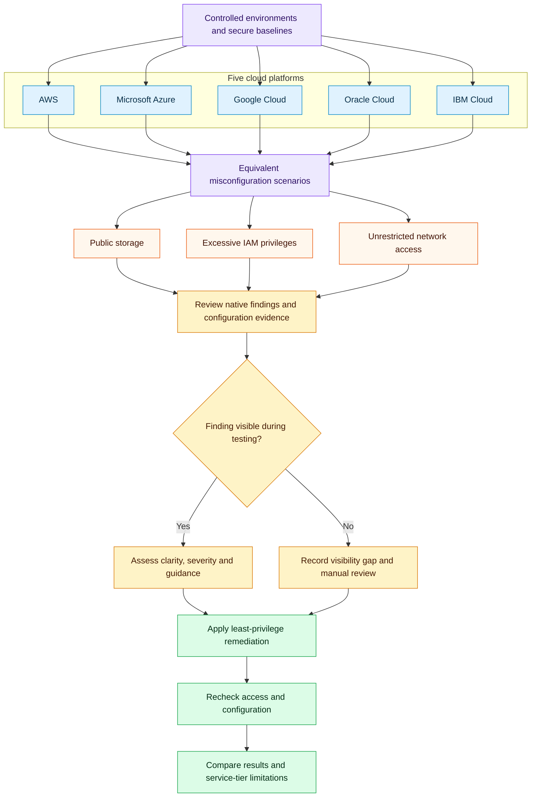
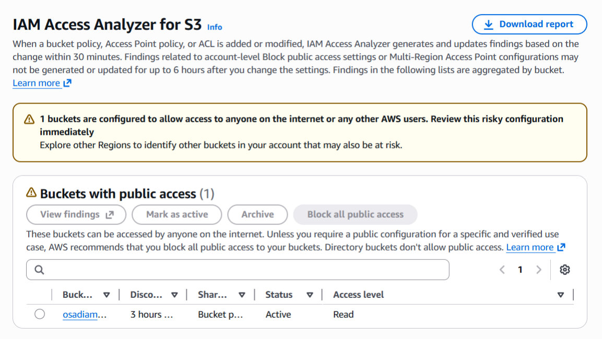
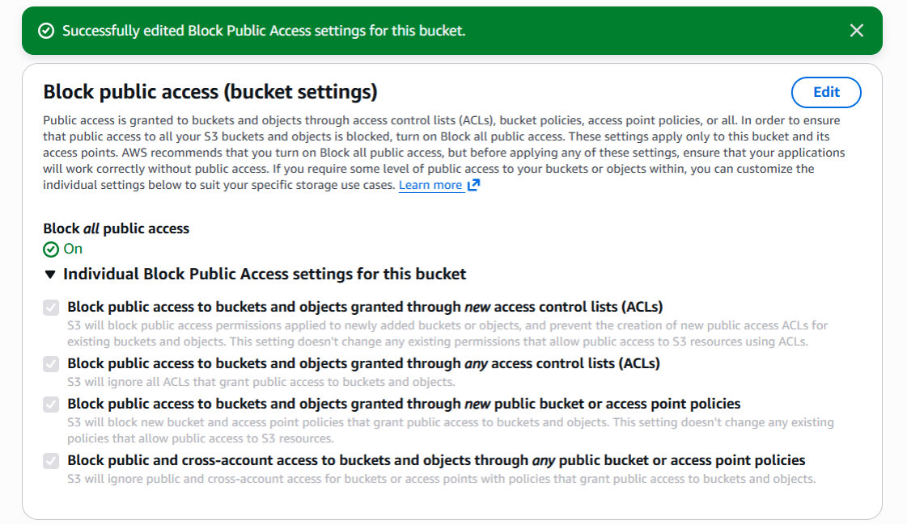
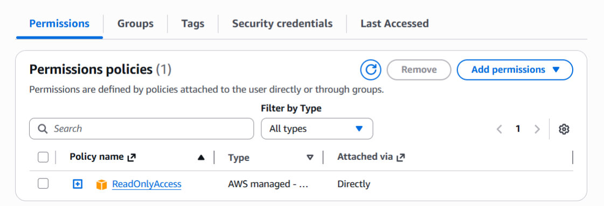
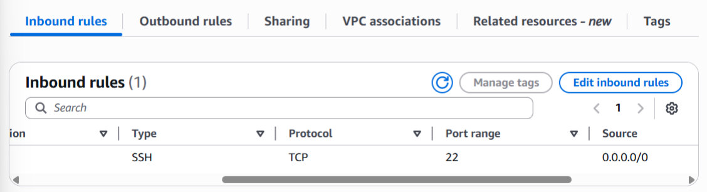

# Multi-Cloud Security Misconfiguration Analysis

A practical comparison of storage, identity and network misconfigurations across **AWS, Microsoft Azure, Google Cloud, Oracle Cloud Infrastructure and IBM Cloud**.

Controlled tests covered public storage, excessive permissions and unrestricted SSH access. Each scenario was checked using the available native security tools, remediated and reviewed again. Testing used free-tier and trial services.

## Scope

| Risk | Configuration tested | Remediation |
| --- | --- | --- |
| Public storage exposure | Storage permissions that allowed unintended public access | Remove public access and review storage permissions |
| Excessive IAM privileges | Users, groups or roles with broader access than required | Reduce permissions in line with least privilege |
| Unrestricted network access | Overly permissive inbound rules, including SSH exposure | Remove unrestricted rules and limit permitted access |

## Investigation workflow

Each provider was tested separately using the same three risk categories.

## Platforms and controls

| Provider | Services and controls examined |
| --- | --- |
| AWS | S3, IAM, IAM Access Analyzer and EC2 security groups |
| Microsoft Azure | Blob Storage, RBAC, network security groups and Microsoft Defender for Cloud |
| Google Cloud | Cloud Storage, IAM, firewall rules and Security Command Center |
| Oracle Cloud Infrastructure | Object Storage, IAM policies and network security rules |
| IBM Cloud | Cloud Object Storage, IAM policies, VPC security groups and Workload Protection |

## Findings

Results from the tested environments. Ratings reflect the services enabled and the observation periods used.

| Provider | Storage detection | IAM detection | Network detection | Overall visibility |
| --- | --- | --- | --- | --- |
| AWS | Strong | Limited | Limited | Moderate |
| Microsoft Azure | Moderate | Limited | Limited | Moderate |
| Google Cloud | Strong | Moderate | Strong | Strong |
| Oracle Cloud Infrastructure | Limited | Limited | Limited | Weak |
| IBM Cloud | Limited | Limited | Limited | Weak |

Google Cloud provided the clearest overall visibility during testing. AWS showed strong storage exposure detection through IAM Access Analyzer. Azure findings sometimes depended on delayed posture assessments, while OCI and IBM Cloud required more manual configuration review in the tested environments.

## Console evidence

AWS console screenshots captured during testing.

### Public storage detected

IAM Access Analyzer for S3 reported one bucket with public read access.

### Public access blocked after remediation

Block Public Access was switched on, with all four individual settings enabled.

<strong>IAM permissions after remediation</strong>

The test user's AdministratorAccess policy was replaced with ReadOnlyAccess. This reduced access, although the AWS-managed policy remains broader than a policy scoped to specific resources.

<strong>Unrestricted SSH rule during testing</strong>

The test security group allowed TCP port 22 from `0.0.0.0/0`. This captures the intentional misconfiguration before remediation.

## Limits of the comparison

Free-tier and trial access restricted some advanced security features. Environments were functionally comparable, but provider architectures and configurations differed. Background scan timing and enabled integrations also affected which findings appeared. An absent finding during a test does not mean a provider cannot detect that risk.

