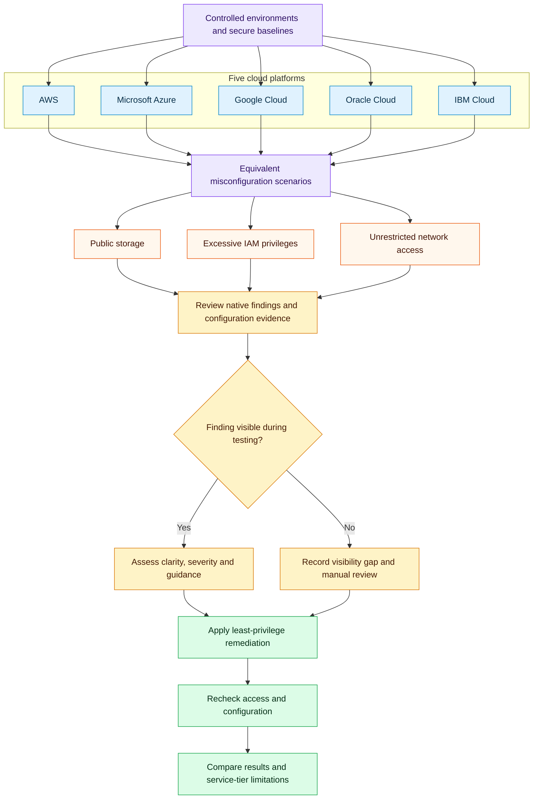

# Multi-Cloud Security Misconfiguration Analysis

My final-year dissertation examined a practical question: when the same security mistake is made across different cloud platforms, how reliably do their native tools identify it?

I built controlled test environments across **AWS, Microsoft Azure, Google Cloud, Oracle Cloud Infrastructure and IBM Cloud**, introduced three types of misconfiguration, reviewed the available security findings, and applied remediation. The comparison focused on the free-tier and trial services available during the project.

## Scope

| Risk | What I examined | Remediation |
| --- | --- | --- |
| Public storage exposure | Storage permissions that allowed unintended public access | Remove public access and review storage permissions |
| Excessive IAM privileges | Users, groups or roles with broader access than required | Reduce permissions in line with least privilege |
| Unrestricted network access | Overly permissive inbound rules, including SSH exposure | Remove unrestricted rules and limit permitted access |

## Investigation workflow

The same risk categories were assessed in five separate environments. This diagram shows the investigation process, rather than a connected multi-cloud architecture.

## Platforms and controls

| Provider | Services and controls examined |
| --- | --- |
| AWS | S3, IAM, IAM Access Analyzer and EC2 security groups |
| Microsoft Azure | Blob Storage, RBAC, network security groups and Microsoft Defender for Cloud |
| Google Cloud | Cloud Storage, IAM, firewall rules and Security Command Center |
| Oracle Cloud Infrastructure | Object Storage, IAM policies and network security rules |
| IBM Cloud | Cloud Object Storage, IAM policies, VPC security groups and Workload Protection |

## Findings

These qualitative ratings reproduce the comparison in Table 6.1 of my dissertation. They describe the configured environments and observation periods used in this project, rather than the full capabilities of each provider.

| Provider | Storage detection | IAM detection | Network detection | Overall visibility |
| --- | --- | --- | --- | --- |
| AWS | Strong | Limited | Limited | Moderate |
| Microsoft Azure | Moderate | Limited | Limited | Moderate |
| Google Cloud | Strong | Moderate | Strong | Strong |
| Oracle Cloud Infrastructure | Limited | Limited | Limited | Weak |
| IBM Cloud | Limited | Limited | Limited | Weak |

Google Cloud provided the clearest overall visibility in my tests. AWS showed strong storage exposure detection through IAM Access Analyzer. Azure findings sometimes depended on delayed posture assessments, while OCI and IBM Cloud required more manual configuration review in the tested environments.

The main lesson was that an insecure setting and a visible security alert are separate things. A dashboard without findings did not establish that the configuration was secure. Reviewing the underlying permissions and network rules remained essential.

## My contribution

- Designed comparable storage, identity and network scenarios across five providers.
- Recorded baseline configurations, intentional misconfigurations and available security findings.
- Compared detection visibility, reporting clarity and remediation guidance.
- Removed public access, reduced excessive permissions and restricted network exposure.
- Documented the before-and-after evidence and limitations in a technical dissertation.

## Limits of the comparison

Free-tier and trial access restricted some advanced security features. Environments were functionally comparable, but provider architectures and configurations differed. Background scan timing and enabled integrations also affected which findings appeared. An absent finding during a test does not mean a provider cannot detect that risk.

## Academic context

**Dissertation:** Investigating and Mitigating Cloud Security Vulnerabilities Across Multiple Cloud Platforms  
**Degree:** BEng (Hons) Computer Networking & Cloud Security, London Metropolitan University  
**Author:** Diame Edoburun
